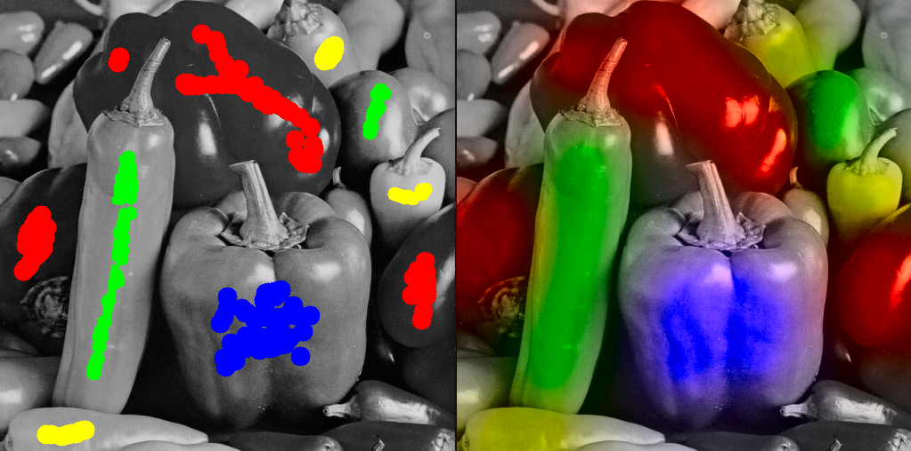
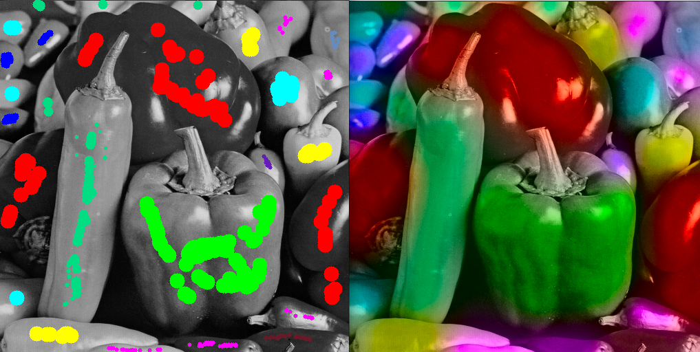

# image-colorization-exploration
An attempt to colorize my old photos





# Usage Instructions

If you want to fork my project and explore new or existing techniques yourself, simply create a virtual environment and install the necessary dependencies as follows:

## 1. Clone the project and create a virtual environment
```bash
git clone https://github.com/agarnung/image-colorization-exploration.git
cd image-colorization-exploration
python3 -m venv venv
source venv/bin/activate  # On Windows use: venv\Scripts\activate
```

## 2. Install the mask creation application
```bash
cd colorMaskerApp && pip install -e .
```

## 3. Run the application from anywhere (inside the `venv`) with the grayscale image you want to colorize
```bash
colormaskerapp --input "path/to/grayscale.png" --output "path/to/result/mask.png"

# Main article

[LINK MY ARTICLE -  QUE SERÁ BÁSICAMENTE EL MISMO MARKDOWN CON ALGUNOS RESULTADOS MÁS...]

umMuchas veces he entrado en mi casa vieja del pueblo y me he encontrado con fotografías antiquísimas de familiares y conocidos lejanos de hace 75, 100 o includo 150 años. Es natural recolorar mentalmente estas imágenes, pero el resultado no suele cumplir nuestras expectativas virtualmente, y desde luego no vamos a ponernos a dibujar con rotulador las el pelo a nuestra bisabuela. Así pues, en este post dedicaremos algo de tiempo a reflexionar cómo podemos diseñar un sistema semi-automático (esto es, con cierto guiado humano, "de usuario") para colorizar imágenes en blanco y negro. De esta forma, podremos escanear nuestras fotos antiguas, pasarlas por nuestro software (desde luego mucho mejor que cualquier Paint y cualquier Photoshop...) e imprimir el anacrónico resultado.

Por supuesto, integraremos métodos variacionales. También puede ser interesante emplear algún tipo de GAN para realizar el colorizado, como algunas soluciones comerciales ya hacen [CITAR EJEMPLOS], aunque en este blog prevalecemos las primeras técnicas. También nos aventuraremos a decir que las técnicas en grafos puede que vayan mejor, ya que tiene una naturaleza que favorece la difusión del color que parece conveniente. 

¿Cómo funcionará la aplicación? En un primer pensamiento afirmamos que no se puede inventar el color de la nada a no ser que lo alucinemos, al fin y al cabo. Así pues, en una primera aproximación el usuario hara "unos pocos" trazos (e.g. el color carne de la cara, el rubio del pelo, el color blanco de la ropa, el verde a la hierba, el azul y blanco del cielo y las nubes, etc.) y el algoritmo "hará evolucionar" esos colores hasta conformar una imagen más o menos convincente. Si no lo es, siempre se puede repetir el proceso, incluso desde usando el resultado poco convincente como semilla inicial.

En una segunda aproximación, modelaremos un agente artificial cuasi-inteligente que estará entrenado con muchas imagenes a color "real" y en gris para que pueda "alucinar razonablemente bien" el color de imagenes grises desconocidas en tiempo de prueba.

Este proyecto planea ser ejemplificativo, así que no nos centraremos en dar resultados fetenes sino en conseguir una aplicación funcional que pueda dar paso a implementar de modo "plug-and-play" métodos más "finos" si cupiera. Por tanto, formularemos un modleo variacional ejemplificativo y una arquitectura de DL ejemplificativa que cumplan con su papel correctamente. 

# Espacios de color

A modo de introducción, daremos unas pocas palabras sobre los espacios de color, que son los segundos protagonistas en esta historia.

Intuitivamente, "inventarnos de la nada" tres canales parece más complicado/imposible que solo dos. Así, en vez de generar canales RGB, tomaremos la imagen en gris como el canal de luminancia y generaremos los canales a y b correspondientes en el espacio Lab. Análogamente, podríamos fijar el canal Y y generar los canales U y V del espacio YUV, u otro espacio similar. Pero con la primera selección no perdemos generalidad, así que trabajaremos en Lab. 

# Con métodos variacionales

Usaremos una no demasiado compleja formulación variacional consiste en un término que "difunda" bastante el color, como el operador bilaplaciana, y un término que "frene" el color en las regiones de gradiente alto (bordes de los objetos), para preservar las regiones con "colores a trozo", como la variación total (TV). Mejor aún, para prmover las regiones "suaves a trozos" y conseguir resultados más placenteros visualmente usaremos la GTV, en vez de la TV.

# Con Deep Learning

## Discusión de posibles soluciones

### Mediante modelos de difusión

Los modelos de difusión son unos tipos de redes neuronales que generan contenido a partir de los datos de entrenamietno. Primero, corrompen los datos originales hasta que se vuelven "irreconocibles", agregando ruido de manera progresiva; luego, aprenden a revertir este proceso paso a paso, reconstruyendo los datos y generando nuevas muestras realistas. Este proceso de "corrupción" se denomina "forward diffusion process".

Esto significa que diseñamos un proceso de corrupción de datos (forward diffusion process) que reduce gradualmente la cantidad de información original de una imagen, hasta que es eventualmente completamente aleatoria.

El ruido que se añade a cada imagen k-1 en el proceso está muestreado de una distribución gaussiana. El modelo de disufión es una red neuronal que aprende cada paso inverso del proceso de difusión forward, es decir, que aprender el denoising de la imagen corrompida. [https://medium.com/@erwannmillon/color-diffusion-colorizing-black-and-white-images-with-diffusion-models-269828f71c81]

¿Cuál es la idea básica de los modelos de difusión? Llenar de ruido blanco una imagen y castear el problema dado como un problema de denoising. En nuestro caso, corromperíamos de ruido blanco los canales de color de la imagen (gris convertido a imagen vectorial) y castearíamos el problema de colorización como un problema de denoisine en los canales a y b, independientemente. Así, entrenaríamos al modelo a aprender a "denoising" los canales de color usando como condicionamiento una imagne en gris.

[INSERTAR GIF RECOGIDO DE https://miro.medium.com/v2/resize:fit:128/format:webp/1*OBfeMpUwCDdWdhT9g8u_Aw.gif]

## Nuestra solución


De las incontables alternativas arquitectónicas vamos a diseñar la nuestras propia y entrenarla con nuestro propio dataset. Centraremos nuestro foco en las escneas que contienen a personaes en paisajes naturales, semi-rurales a lo sumo.

# Referencias

- Con AutoEncoder (Inception-Resnet-v2): https://github.com/ajaychaudhary7/Image-Colorization
- Otro con AutoEncoder [Medium](https://medium.com/@geokam/building-an-image-colorization-neural-network-part-1-generative-models-and-autoencoders-d68f5769d484) y [repo])https://github.com/PacktPublishing/Advanced-Deep-Learning-with-Keras/tree/master/chapter3-autoencoders)
- En Lab: Otro con AutoEncoder + VGG como encoder (== feature extractor) https://github.com/Ananyaa26/Image-Colorization-using-Deep-Learning 
- Con modelo de difusión: [Medium](https://medium.com/@erwannmillon/color-diffusion-colorizing-black-and-white-images-with-diffusion-models-269828f71c81) y [repo](https://medium.com/@erwannmillon/color-diffusion-colorizing-black-and-white-images-with-diffusion-models-269828f71c81)
- GAN + U-Net en Lab https://github.com/moein-shariatnia/Deep-Learning/tree/main/Image%20Colorization%20Tutorial(ºº
- Con VAE https://github.com/alexandrasalem/image_colorization
- Awesome list (sobre todo ver 2.1. based on scribble) https://github.com/MarkMoHR/Awesome-Image-Colorization?tab=readme-ov-file#21-based-on-scribble

- Mask CLI app inspired in https://github.com/aGIToz/PiMask/tree/main.

# TODO
- Pequeña app mínima como la de https://github.com/aGIToz/PiMask para colorizar y guardar las máscaras de trazos RGB que se usaran. Mediante CLI poner a pruebas los métodos.


