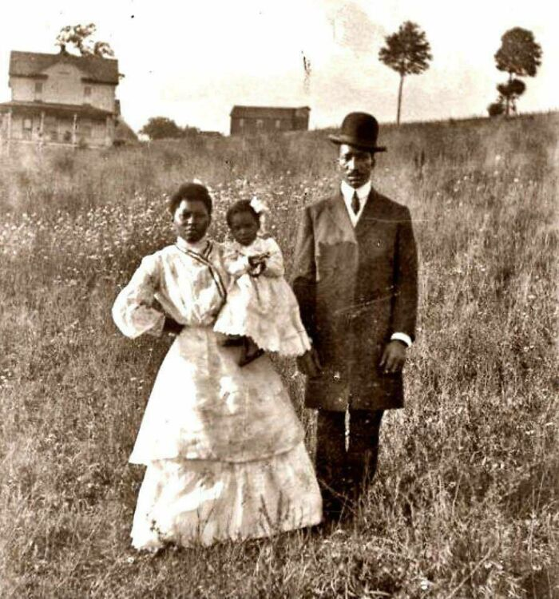

# image-colorization-exploration
An attempt to colorize my old photos

## Our Solution

Among the countless architectural alternatives (see [LINK TO MY ARTICLE - WHICH WILL BE BASICALLY THE SAME MARKDOWN WITH SOME ADDITIONAL RESULTS...]), we will design our own solution and train it using our own dataset. We will focus natural images.

We use two approaches for the colorization task:

- A variational approach (see [this](./src/variational/README.md)): It consists of minimizing an energy functional with two terms, a smoothing term that diffuses colors across objects and a fidelity term that preserves user-provided color hints, solved via Euler-Lagrange PDEs.

<table>
  <tr>
    <td></td>
  </tr>
  <tr>
    <td></td>
  </tr>
</table>

- A Deep Learning aproach (see [this](./src/dl/README.md)): It uses a conditional GAN with U-Net generator and patch discriminator. The model combines adversarial loss (for realism), Huber loss (for color accuracy) and VGG loss (for perceptual integrity), trained in Lab space.

<table>
  <tr>
    <th>Ground Truth</th>
    <th>Colorization</th>
  </tr>
  <tr>
    <td></td>
    <td></td>
  </tr>
  <tr>
    <td></td>
    <td></td>
  </tr>
  <tr>
    <td></td>
    <td></td>
  </tr>
  <tr>
    <td></td>
    <td></td>
  </tr>
  <tr>
    <td></td>
    <td></td>
  </tr>
  <tr>
    <td></td>
    <td></td>
  </tr>
  <tr>
    <td></td>
    <td></td>
  </tr>
</table>

# Usage Instructions

If you want to fork my project and explore new or existing techniques yourself, simply create a virtual environment and install the necessary dependencies as follows:

**1. Clone the project and create a virtual environment**

```bash
git clone https://github.com/agarnung/image-colorization-exploration.git
cd image-colorization-exploration
python3 -m venv venv
source venv/bin/activate  # On Windows use: venv\Scripts\activate
```

**2. Install the mask creation application**

```bash
cd colorMaskerApp && pip install -e .
```

**3. Run the application from anywhere (inside the venv) with the grayscale image you want to colorize**

```bash
colormaskerapp --input "path/to/grayscale.png" --output "path/to/result/mask.png"
```

The model weights are uploaded in Releases (and it should be e.g. in /opt/image-colorization-exploration/src/dl/model/modelo_completo_500epoch.pth)