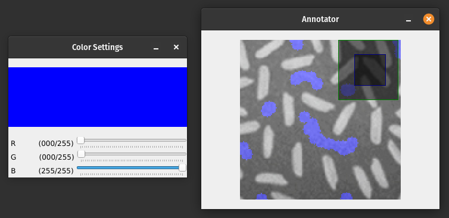

# colorMaskerApp

Esto es una sencilla herramienta CLI para crear máscaras RGB de cualquier imagen, a fin de utilizarlas postreiormente para colorizing o inpainitng, por ejemplo.

Realmente puedes usar Paint, o algo así, para crear tus máscaras, pero esto verdaderamente asegura que el tamaño, los colores y sus posiciones son las requeridas.

El directorio `./colormaskerapp/` de aquí dentro es el directorio del paquete.

# Introducción

Hay que elegir de una paleta de color mediante click derecho, y click izquierda para dibujar, y habilitar goma pulsando b. la finalidad es crear una máscara rgb para posteriormente usarla yo para hacer colorizing. Asumamos que el negro es "no dibujado", o sea (0,0,0) es no dibujado e inicialmente está todo no dibujado (asumamos que no existe el color o trazo completamente negro). Luego el usuario dibuja lo que quiere del color que quieres los trazos que quiere, y pulsando s lo guarda en el directorio actual bajo el bnombre que escriba con un dialog de pyqt.

# Usage

1. Activate your venv (optional) and install dependencies (see **Thoubleshooting** below).
2. Desde el directorio raíz /opt/image-colorization-exploration/colormaskerapp install the module in editable mode (for development) with `pip install -e .` or in user mode (prefered) with `pip install .`. Esto instalará el paquete y sus dependencias, además de registrar el comando CLI definido en `entry_points.txt`.
3. Run the application with `colormaskerapp --input /home/alejandro/Imágenes/uneven_ilumination/2.jpg --output ./mask_cells.jpg`.

This will open the following GUI, in which you can draw your mask:



And when you save the mask, it will be copied into the specified path:


## Instructions

Press H with the application running to see the instructions in the command line

Controls:
- Hold R and move the mouse to draw with the specified color (in the sliders of the Color Settings window)
- +/-: Change brush size
- S: Save mask online
- H: Show help
- ESC: Exit

# Troublehsooting

1. Install System Dependencies

Debian/Ubuntu/Pop!_OS...
```bash
sudo apt-get update
sudo apt-get install -y \
    libxcb-xinerama0 \
    libxcb-render-util0 \
    libxcb-image0 \
    libxcb-keysyms1 \
    libxcb-icccm4 \
    libxcb-xkb1 \
    libxkbcommon-x11-0 \
    libgl1-mesa-glx \
    libglib2.0-0 \
    libsm6 \
    libxrender1 \
    libfontconfig1 \
    libxext6
```

2. Set the QT_PLUGIN_PATH Environment Variable
```bash
export QT_PLUGIN_PATH=/opt/image-colorization-exploration/venv/lib/python3.10/site-packages/PyQt5/Qt5/plugins
```

