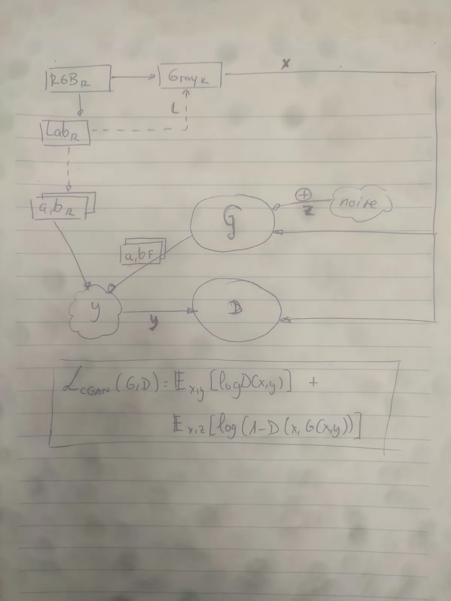

Este modelo de deep learning se basa en las referencias citadas.

- El script test.py sirve para poner a prueba nuestro modelo de colorización con la imagen de entrada, e.g.:

```bash
test.py /full/path/to/image.png
```

Se guardará el resultado en el mismo path desde el que se invoca el comando. 

The model weights are uploaded in Releases (and it should be e.g. in /opt/image-colorization-exploration/src/dl/model/modelo_completo_500epoch.pth). To test on the [Jupyter notebook](https://github.com/agarnung/image-colorization-exploration/blob/main/src/dl/notebook.ipynb), download the prefered Release model of this repository and replace the full path of the weights in the last snippet, if needed.

Problemas principales en el colorizig?:

- **Color bleeding**: el problema por le cual el color de una región se trasnfiere a lo largo y ás allá de las frontesras que separan objetos que deberían tener colores distintos, causnado un esparcimiento incoherente del color y problemas de blending y innacuracies en el resultado final colorizado.

**Estado del arte**:

Referimos al _Related Works_ del artículo [_ParaColorizer: Realistic Image Colorization using Parallel Generative Networks_](https://arxiv.org/pdf/2208.08295v1) para una revisión de varios métodos exitosos de colorización de imágenes, divididos en vraios grupos:
1. **User-guided colorization**: Métodos que requieren intervención humana, donde el usuario proporciona trazos o puntos de color en la imagen en escala de grises. Estos colores iniciales se propagan por la imagen basándose en la similitud de luminancia, bordes o texturas e incluso funciones de edge-stopping para prevenir el color bleeding entre regiones. Algunos métodos combinan esta técnica con aprendizaje profundo para reducir el esfuerzo manual.
2. **Example-guided colorization**: Métodos que utilizan imágenes de referencia para transferir colores de la referencia al resultado deseado. Pueden basarse en estadísticas globales como la media y la varianza del color, o en transferencias más detalladas que consideran la estructura de la imagen a nivel de píxel o segmentos. La calidad del resultado depende en gran medida de la imagen de referencia utilizada.
3. **Learning-based colorization**: Métodos completamente automáticos que utilizan redes neuronales entrenadas con grandes conjuntos de datos para aprender patrones de colorización. Algunos enfoques combinan información semántica ("modelos multimodales") con modelos de aprendizaje profundo para mejorar la coherencia de los colores en distintos objetos y escenas. Otros buscan manejar la variabilidad de los colores naturales generando múltiples posibles colorizaciones.
4. **Image colorization with GANs**: Métodos basados en redes generativas adversariales (GANs), donde un modelo aprende a generar imágenes en color a partir de versiones en escala de grises. Algunas aproximaciones utilizan auto-supervisión para mejorar la calidad del color y la coherencia semántica, mientras que otras combinan múltiples redes (paralelas) para manejar mejor el color en diferentes partes de la imagen, y luego fusionan sus salidas en un resultdao final.

Tanto los métodos tradicionales como los de3 prendizaje automático incorporan términos matemáticos localizables en sus funciones de coste, como regularizadores, para promover cierta característica deseable para buscar una solucion coherente en el vasto espacio de imágenes.

# GAN Network Explanation

El esfuerzo invertido en la colorización de imágenes ha cambiado infinitamente con el uso del DL. Especialmente, se han diseñado [metologías](https://towardsdatascience.com/colorizing-black-white-images-with-u-net-and-conditional-gan-a-tutorial-81b2df111cd8/) eficientes de entrenamiento con datasets más bien escuetos que proporcionan resultados increíbles. Unas de las arquitecturas más prometedoras es la GAN (Generative Adversarial Network). 

Como mencionan en [este artículo](https://towardsdatascience.com/colorizing-black-white-images-with-u-net-and-conditional-gan-a-tutorial-81b2df111cd8/), [Image-to-Image Translation with Conditional Adversarial Networks paper](https://arxiv.org/abs/1611.07004), which may be known by the name **pix2pix**, dan un enfoque diferente a los clásicos de solo clasificación o regresión y proposed a general solution to many image-to-image tasks in DL which one of those was colorization. In this approach two losses are used: 

- Huber loss, which makes it a regression task
- An adversarial (GAN) loss, which helps to solve the problem in an unsupervised manner (by assigning the outputs a number indicating how "real" they look!).

Así, primero seguiremos los pasos de [Image-to-Image Translation with Conditional Adversarial Networks paper](https://arxiv.org/abs/1611.07004) y construiremos una red GAN conditional con una pérdida Huber adicional.

> [!INFORMATION]
> ¿Cómo funciona una red GAN? Esta está compuesta de un modelo generador y otro discriminador, que colaboran juntos para aprender cómo resolver un problema dado.

Usamos el espacio de color Lab. Nuestro generador toma imágenes en gris (canal L) y produce dos imágenes, el canal a y b. Nuestro discriminador toma esta imagen a color generada y decide si es real o falsa. ¿A qué nos referimos? Las imagenes de nuestro datset son reales y las que crea el generador son falsas; nuestro generador deberá aprender lo suficientemente bien para "engañar" al discriminador y que confunda imágenes generadas con verdaderas. En ese punto, nuestro generador estará generando imágenes verosímiles.

En las GAN Condicionales, el objetivo es generar imágenes basadas en una condición específica; en este caso, la condición es una imagen en escala de grises $x$ que se usa como entrada tanto para el generador matchal{G} como el discriminador mathcal{D}.

## GAN Loss Function

Esta pérdida sirve para "produce good-looking colorful images that seem real".

La **función de pérdida** para un GAN condicional puede dividirse en dos componentes: la pérdida del generador y la pérdida del discriminador. El generador intenta crear imágenes que se vean realistas a partir de una imagen en escala de grises xx y ruido zz, mientras que el discriminador trata de diferenciar entre las imágenes reales y las generadas.

> [!NOTE]
> EL ruido lo introducimos para robustecer la red (y aquí entraría en juego la robustez a ataques adversarios, etc.). El ruido zz lo introducimos en el generador a través de capas de dropout (estas son las fuentes de ruido) (véase el artículo citado) en lugar de un vector de ruido de nn-dimensiones. Este enfoque tiene ciertas ventajas, pues el dropout funciona como una forma de regularización que hará resultados menos deterministas que si no agregáramos ruido (esto se llama **adversarial training**).

Generador: Trata de generar imágenes yy (de 2 canales, como los colores) que sean indistinguibles de las imágenes reales cuando se les da la entrada xx y ruido zz.

Discriminador: Intenta predecir si las imágenes yy son reales o generadas, dadas xx como condición.

La función de pérdida general en este escenario es la siguiente:
\mathcal{L}_{\text{GAN}} = \mathbb{E}_{x, y \sim p_{\text{data}}(x, y)}[\log D(x, y)] + \mathbb{E}_{x, z \sim p_{\text{data}}(x), p(z)}[\log(1 - D(x, G(x, z)))]

Donde:

- xx es la imagen en escala de grises (la condición que alimenta tanto al generador como al discriminador).

- yy es la imagen de salida generada (con los 2 canales de color).

- G(x,z)G(x,z) es la salida del generador, que toma la imagen en escala de grises xx y el ruido zz.

- D(x,y)D(x,y) es la salida del discriminador, que clasifica si la imagen yy es real o generada, dados xx como condición.

En los GANs, las probabilidades que genera el discriminador DD están en el rango [0, 1]. TOmamos el logaritmo para tomar valores más manejables. The log transformation maps the outputs from the discriminator, which are between 0 and 1, to a range of negative infinity to 0. This makes it easier to understand how close the discriminator is to correctly classifying the input as real or fake. Additionally, the logarithmic scale means that small errors in the output of the discriminator are more heavily penalized than large errors (expected values would result in very small floats), which can help the training process converge more quickly. ([see](https://www.reddit.com/r/learnmachinelearning/comments/10hkirm/what_is_the_purpose_of_taking_the_log_of_the_2/?rdt=34741))

### Desambiguémos:

¿Qué recibe el generador y el discriminador?

- Generador (GG):

    - El generador no recibe imágenes a color como entrada.

    - Recibe la imagen en escala de grises xx (la condición) y un vector de ruido zz.

    - Su objetivo es generar una imagen a color yy a partir de la imagen en escala de grises xx y el ruido zz. La imagen generada y=G(x,z)y=G(x,z) es el resultado del proceso de colorización.

- Discriminador (DD):

    - El discriminador recibe la imagen en escala de grises xx y una imagen a color yy.

    - Su tarea es determinar si la imagen yy es real (es decir, proviene del conjunto de datos de imágenes reales) o generada por el generador.

    - La salida del discriminador D(x,y)D(x,y) es un valor entre 0 y 1, donde 1 indica que yy es real y 0 indica que yy es generada.

Ground truth (imágenes a color reales):

- Las imágenes a color reales (que son el "ground truth" o "verdadero objetivo") solo se usan para entrenar el discriminador.

- En el caso del generador, no se le da directamente la imagen a color como entrada, sino que el generador intenta predecirla a partir de la imagen en escala de grises xx.



## Huber Loss Function

Aún necesitamos otra pérdida, to further help the models and introduce some supervision in our task. Usamos la pérdida Huber, que es un equilibrio inteligencte entre las propiedades de L1 (o Mean Absolute Error) y L2 (o Mean Squared Error) of the predicted colors compared with the actual colors; aquí está nuestro paso de aprendizaje supervisado.  The loss is the following:

LHuber​(G)=Ex,y,z​[i∑​{21​(yi​−G(x,yi​))2δ⋅(∣yi​−G(x,yi​)∣−2δ​)​si ∣yi​−G(x,yi​)∣≤δsi ∣yi​−G(x,yi​)∣>δ​]

- δ → 0: Se aproxima a L1 (MAE) para todos los errores

- δ → ∞: Se aproxima a L2 (MSE) para todos los errores

The L1 Loss is usually preferred over L2 loss (or mean squared error) because it reduces that effect of producing gray-ish images (es más robusta a outliers y tiende a sobre-suavizar menos ). SIn embargo, HUber loss usa L1  para errores pequeños < delta (Robustez frente a outliers y bordes preservados), mientras que usa L2  para errores grandes >=delta (Suaviza gradientes y favorece convergencia estable).

> [!NOTE]
> "Sobre-suavizar" en colorización puede adoptar aquí el significado de "sobre-engrisecer".

## Perceptual Loss

Agregamos una Pérdida Perceptual (usando VGG16) para:  
- **Mejorar coherencia semántica** (objetos reconocibles)  
- **Preservar estructuras** (bordes/texturas realistas)  
- **Reducir artefactos** (manchas/colores antinaturales)  

## Regularización de Color 

Para combatir el problema de imágenes apagadas (sobresuavizado de colores), introducimos una pérdida de color o cromaticidad que incentiva al generador a producir colores más vibrantes. Esta pérdida actúa como un regularizador que penaliza soluciones grisáceas o de bajo contraste. Al maximizar la cromaticidad, evitamos que el generador "juegue a lo seguro" con colores cercanos al gris.

La cromaticidad se calcula como la norma de los canales ab en el espacio LAB:

L₍chroma₎ = −λ₍color₎ ⋅ E[√(a² + b²)]

donde `a, b`: Canales de color predichos por el generador y `λ_color`: Peso de la pérdida (empíricamente λ=10 en nuestro código).

**Mecanismo:**  
1. Extrae features de capas intermedias de VGG (relu2_2, relu3_3)  
2. Compara features entre imágenes predichas/reales con L1  
3. Peso recomendado: `λ=10-20` (balance con otras pérdidas)

## Final Loss

Combinando ambas:

G* = argminGmaxD L_cGAN(G, D) + lambda*L_Huber(G),

where λ is a coefficient to balance the contribution of the two losses to the final loss (of course the discriminator loss does not involve the Huber loss).

Nótese que cGAN, el objetivo es un juego adversarial:

- Discriminador (D): Busca maximizar su habilidad para distinguir entre datos reales y generados (maximiza L_cGAN). Que quiera maximizar su esperanza (el promedio sobre todos los datos posibles de una distribución) significa que quiere estar los más seguro posible de sus decisiones (aparte de que sean ciertas).

- Generador (G): Busca minimizar la capacidad de D de detectar sus salidas (minimiza L_cGAN) y, además, reduce el error Huber (para mantener coherencia con los datos reales).

> [!NOTE]
> ¿Y si usáramos solamente la L1 loss y no la GAN loss?
> Como bien notan [aquí](https://towardsdatascience.com/colorizing-black-white-images-with-u-net-and-conditional-gan-a-tutorial-81b2df111cd8/), If we use Huber loss alone, the model still learns to colorize the images but it will be conservative and most of the time uses colors like "gray" or "brown" because when it doubts which color is the best , it takes the average and uses these colors to reduce the Huber loss as much as possible.

## Generador

Usamos una U-Net como generador de la GAN. Originalmente fue diseñada para segmentación de imágenes médicas. Pero en este contexto es la que aprende a "colorear" las imagenes en gris de su entrada. Estamos aprovechando su natural capacidad de extraer características (globales y locales) ricas de las imágenes.

La U-Net sigue una estructura en forma de U:

- Downsampling (Compresión): Reduce la resolución de la imagen mientras extrae características.

- Bottleneck (Parte más profunda): Representación comprimida de la imagen.

- Upsampling (Expansión): Vuelve a aumentar la resolución, generando la imagen de salida.

- Skip connections: Conectan capas de compresión con capas de expansión (saltándose conexiones) para recuperar detalles.


En el código, la U-Net se construye empezando desde el punto más bajo de la U y agregando módulos de downsampling y upsampling hasta completar la estructura (e.g. Input (256x256) => Down 1 (128x128) => ... => Down n (2x2) => Bottleneck (1x1) => Up n (2x2) => ... => Up 1 (256x256))

### Changing the backbone of the Generator

Aunque no se lleva a cabo, se recomienda lee la idea mencionada en [este trabajo](https://github.com/moein-shariatnia/Deep-Learning/tree/main/Image%20Colorization%20Tutorial), donde se pre-entrenda un generator separately in a supervised and deterministic manner to avoid the problem of "the blind leading the blind" in the GAN game where neither generator nor discriminator knows anything about the task at the beginning of training.  Actually the pretrain is done in two stages: 

1. The backbone of the generator (the down sampling path) is a pretrained ResNet18 for classification (on ImageNet) 
2. The whole generator (U-Net) will be pretrained on the task of colorization with only L1 loss. Then we will move to the combined adversarial and L1 loss, as we did in the previous section.

## Discriminador

El discriminador en esta GAN tiene la tarea de diferenciar entre imágenes reales y falsas generadas por la U-Net. Usamos un **Patch Discriminator** en lugar de un discriminador estándar. ¿En qué consiste?

En una GAN clásica, el discriminador devuelve un único número que indica si la imagen completa es real o falsa. En un Patch Discriminator, en cambio:

- Divide la imagen en pequeños parches (por ejemplo, de 70x70 píxeles).
- Evalúa cada parche por separado, en lugar de toda la imagen.
- Devuelve una matriz (ej. devolverá una matriz de 30×30 valores; cada salida del discriminador evalúa un parche de 70x70 dentro de la imagen), donde cada valor representa la probabilidad de autenticidad de un parche. 

Esto permite enfocarse en detalles locales en lugar de juzgar la imagen "como un todo", evita que el generador "engañe" con "trucos" globales, menos convenientes que los locales, al discriminador, y mejorar la calidad y coherencia de la colorización de manera más detallada.

El PatchDiscriminator está construido por diferentes bloques repetitivos:

1. Conv2D: Extrae características con filtros convolucionales.
2. BatchNorm: Normaliza los valores para estabilidad.
3. LeakyReLU: Activa las neuronas con una función no lineal.

Con dos excepciones:

- El primer y último bloque NO tienen normalización (porque la primera capa maneja la entrada en crudo y la última capa debe mantener la salida sin alteraciones).

- La última capa tampoco tiene activación (la activación se maneja en la función de pérdida).

# Features

- Se usa Conformal Prediction para, además del resultado de la imagen colorizada RGB, se usa un set de calibración gracias al que se calibra el modelo para proporcionar un conjunto de 3 matrices R^mxnx2 con rango de conformidad (1-alpha) % para los R, G, y B verdaderos. Es decir, tres máscaras que contienen aquellos rangos de valores (R, G, B) dentro de los que está el color verdadero con una probabilidad empírica y teóricamente probale de (1-alpha) %, bajo el supuesto de intercambiabilidad.

[INSERTAR IMAGEN EXPLICATIVA TODO SISTEMA DL y SALIDA CONFOMAL PREDICTION](./dl.png)

# TODO

- Agregar CP al método, como en [Colorful Image Colorization](https://arxiv.org/abs/1603.08511), donde considered the uncertainty of this problem (e.x. a car in the image can take on many different and valid colors and we cannot be sure about any color for it) y vieron el colorizing como un problema de clasificación.

# References

- With AutoEncoder (Inception-Resnet-v2): https://github.com/ajaychaudhary7/Image-Colorization
- Another with AutoEncoder [Medium](https://medium.com/@geokam/building-an-image-colorization-neural-network-part-1-generative-models-and-autoencoders-d68f5769d484) and [repo](https://github.com/PacktPublishing/Advanced-Deep-Learning-with-Keras/tree/master/chapter3-autoencoders)
- In Lab: Another with AutoEncoder + VGG as encoder (i.e., feature extractor) https://github.com/Ananyaa26/Image-Colorization-using-Deep-Learning
- With diffusion model: [Medium](https://medium.com/@erwannmillon/color-diffusion-colorizing-black-and-white-images-with-diffusion-models-269828f71c81) and [repo](https://medium.com/@erwannmillon/color-diffusion-colorizing-black-and-white-images-with-diffusion-models-269828f71c81)
- GAN + U-Net in Lab: https://github.com/moein-shariatnia/Deep-Learning/tree/main/Image%20Colorization%20Tutorial (con [artículo](https://towardsdatascience.com/colorizing-black-white-images-with-u-net-and-conditional-gan-a-tutorial-81b2df111cd8/) de TowardsDataScience que lo acompaña)
- With VAE: https://github.com/alexandrasalem/image_colorization
- Grayscale Image Colorizations using GANs: [gan-image-colorizer](https://github.com/prajwaldp/gan-image-colorizer)

- Awesome list (especially see section 2.1 based on scribble): https://github.com/MarkMoHR/Awesome-Image-Colorization?tab=readme-ov-file#21-based-on-scribble
- ParaColorizer: [web](https://deepai.org/publication/paracolorizer-realistic-image-colorization-using-parallel-generative-networks) y [paper](https://arxiv.org/pdf/2208.08295v1).
